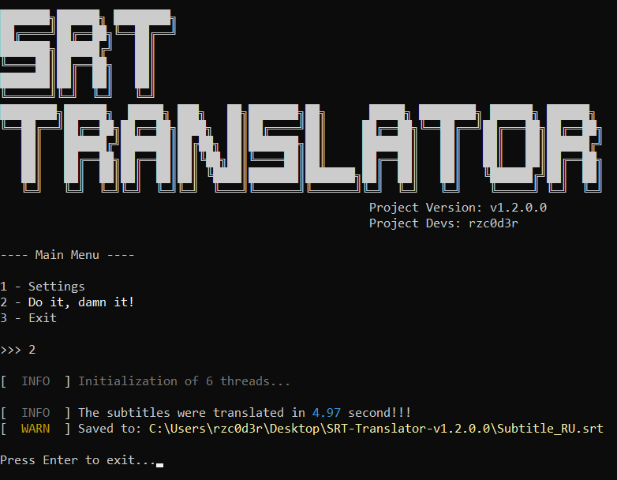

# SRT-Translator
SRT-Translator - Free and fast .srt subtitle translator implemented in Python


---

# How to use

### Installing python and libraries (requires at first startup)

> You can skip this step if you use the compiled executable file from the release

1. Go to the official [Python website](https://www.python.org/downloads) and download the version for your system (the project runs starting with [Python 3.7.0](https://www.python.org/downloads/release/python-370))

2. Next, install/upgrade the Python libraries, in terminal using requirements.txt:

```
pip install -r requirements.txt
```

3. Use the console to open _main.py_ with arguments (Read more [here](wiki/CommandLineArguments.md)) or double-click main.py (It will switch to [MBCI mode](wiki/MBCI-Inferface.md))

4. Wait for all subtitle blocks to be translated:



5. Get the translated subtitle file, which will be located at the path You specified in the startup arguments!

---

# Additional information
1. Your .srt file must be perfect in terms of partitioning, and the program's behavior will be unpredictable!!!
2. Currently, the project may be unstable and the translation is not very accurate (all will be better in the future)
3. **I did this as I was pissed off with the crooked and paid subtitle translation sites!!!**
4. I highly recommend using this project together with [**WinWhisper**](https://github.com/GewoonJaap/WinWhisper)!
