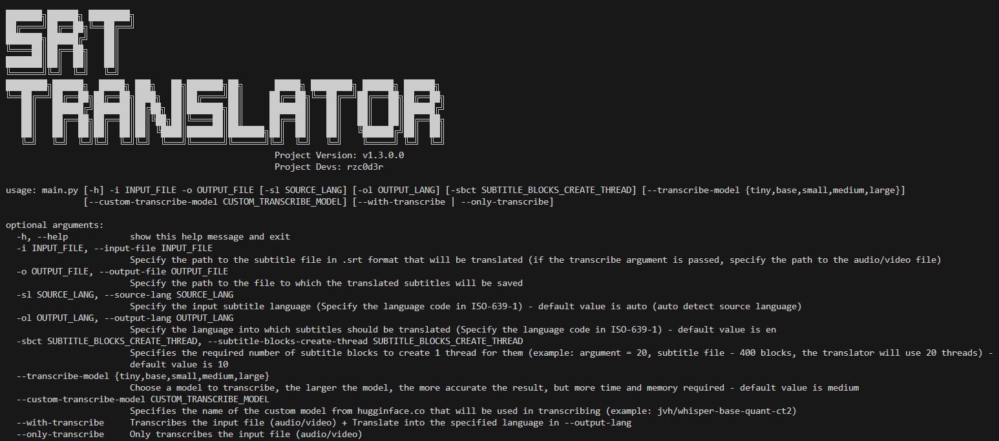

# SRT-Translator
SRT-Translator - Free and fast .srt subtitle translator implemented in Python



---

# How to use

### 1. Installing python and libraries (requires at first startup)

> You can skip this step if you use the compiled executable file from the release

1. Go to the official [Python website](https://www.python.org/downloads) and download the version for your system (the project runs starting with [Python 3.8.0](https://www.python.org/downloads/release/python-380))

2. Next, install/upgrade the Python libraries, in terminal using requirements.txt:

```
pip install -r requirements.txt
```

### 2. Installing **CUDA11** libraries

> You can skip this step if you will not use transcribe mode

The program will install them by itself, but if by some error it didn't happen, you should download and unpack them manually to the location of the executable file / source code (```main.py``` file)

#### Links to archive with libraries
* [Windows](https://github.com/Purfview/whisper-standalone-win/releases/download/libs/cuBLAS.and.cuDNN_CUDA11_win_v2.zip)
* [Linux](https://github.com/Purfview/whisper-standalone-win/releases/download/libs/cuBLAS.and.cuDNN_CUDA11_linux_v2.zip)

> The project has not been tested on macOS, maybe if you can find libraries for macOS that match these exactly, maybe everything will work, but macOS support has not been built in at this time!

> Let me know if you find something!

### 3. Finish

The program should now work correctly, but before doing so I recommend reading the rest of the documentation at the links below, especially:
* Modes of Operation
* Command Line Arguments
* MBCI (Menu-based Сonsole Interface)

---

# Links to all documentation

1. [Modes of operation](wiki/Modes.md)
2. [Command line arguments](wiki/CommandLineArguments.md)
3. [MBCI (Menu-based Сonsole Interface)](wiki/MBCI-Inferface.md)
4. [Available languages](wiki/Available-Languages.md)
